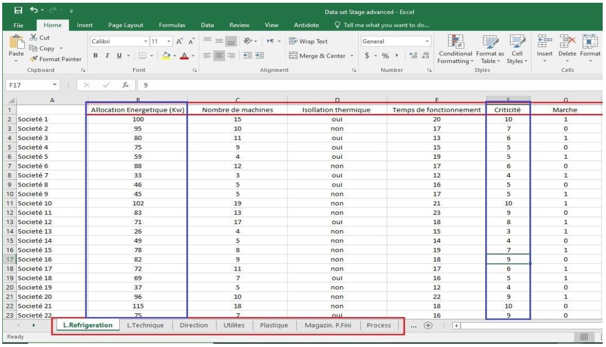

Data pre-processing.
=================

#### Data compilation.

In general, or from a machine learning perspective: A Dataset is a
set of entities and associated values ​​under a particular enterprise to which it is possible
to access individually or as a complete element, which are organized with a structure of
data. ML is highly dependent on data. But whatever be your terabytes of information, if you fail to understand the data, a machine (ML algorithm) will be almost useless or maybe even harmful. This is why data pre-processing is such an important step in the ML process.
In a nutshell, data pre-processing is a set of procedures that help make your dataset
more suitable for machine learning. Preparation also includes establishing the right data collection mechanism, and these procedures consume a lot of the time spent on machine learning design. Sometimes it takes months before the first algorithm is built!
Two ways to collect data for this model:

1. Trust open source data
2. Collected data based on previous experiences.

#### Dataset.

in this particular model, the dataset will contain the following entities for 200 comparable companies,
these are the independent variables:

- Energy Allocation (Kw) [Used]
- Number of machines [Not used]
- Thermal insulation [Not used]
- Operating time (h) [Not used]
- Criticity (1-10) [Used]

To then predict at a given time the independent variable that will inform us and judge whether we should
supply the targeted process or equipment in question with the energy or cut it, that by doing a whole calculation and analysis which will be established with an algorithm given by taking into consideration all the data offered by the dataset

- This model we will consider the binary dependent variable (Yes/No).

