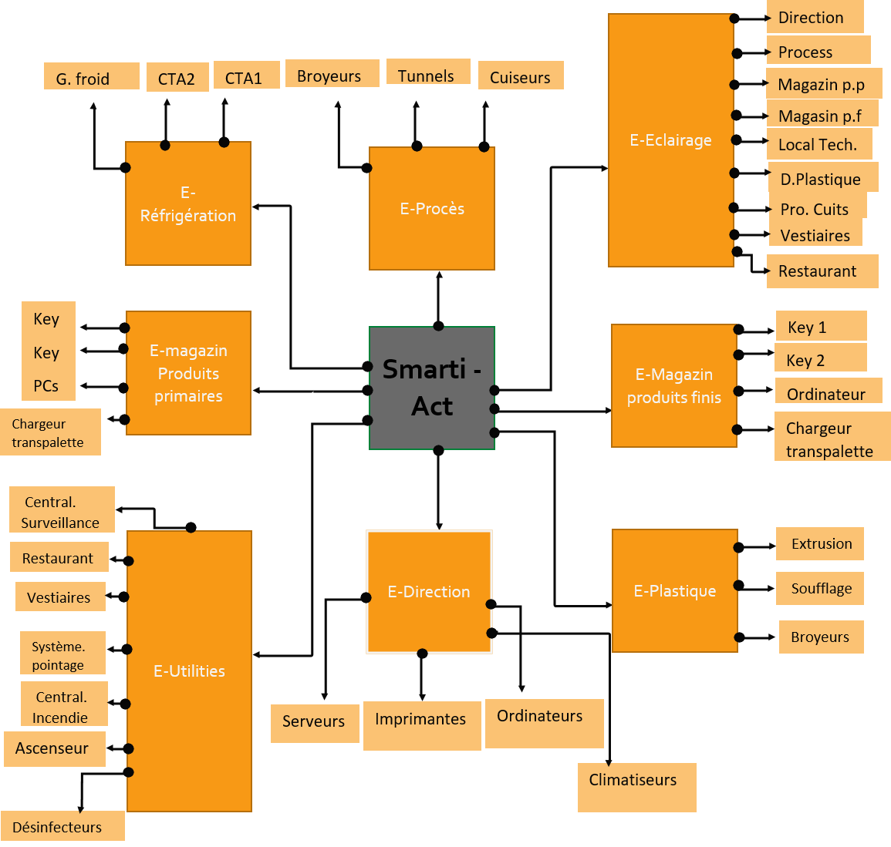
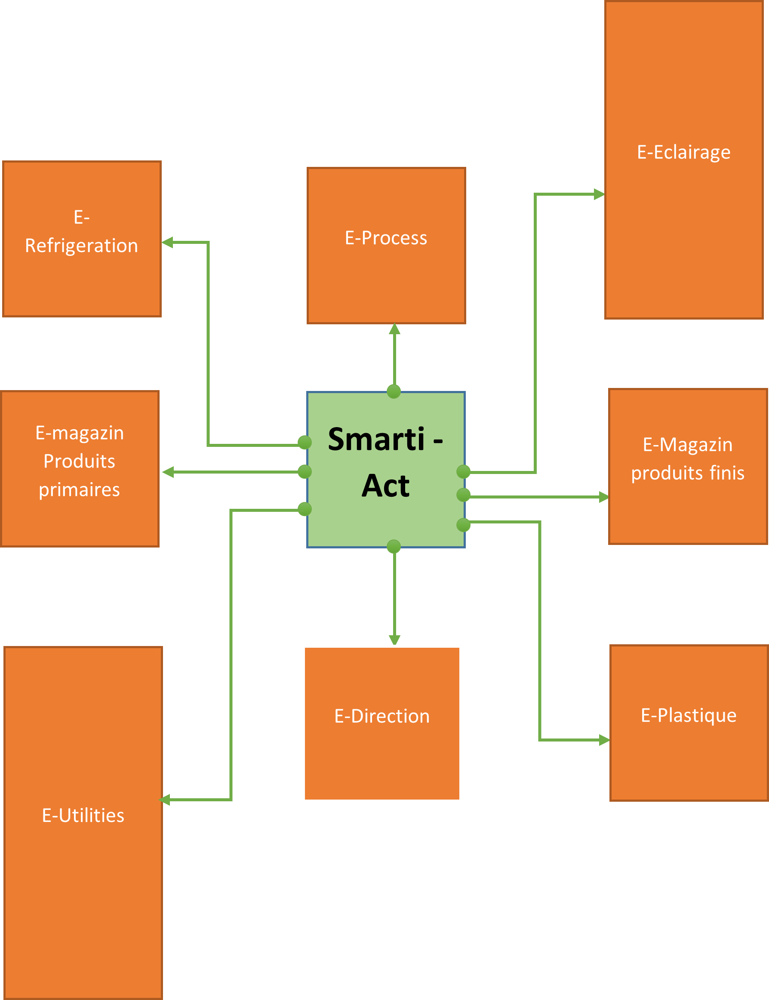
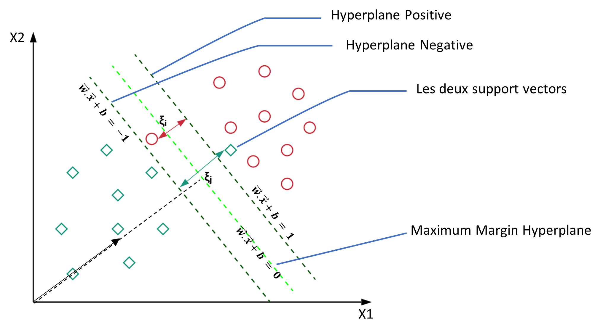

Managment policy.
=====================

### Model typical processes. 

Here I took an 'X' company as an example to start with, this typical X company has the bellow set of processes and equipments, a large scale implementation can be way bigger than this for more advance application.

note: names are in french language.

### List of process. 

In the field of candy and sweet manifacturing, often, blueprint of companies in this sector of industries have the following departments: 

Processus de production.(Production processes)

- Les broyeurs.(Grinders)
- Les tunnels.(tunnels)
- Les cuiseurs. (Cookers)

Eclairage.(lighting)

 - La Direction.
 - Processus.
 - Magasin P.P.(Raw materials warehouse)
 - Magasin P.F.(finished products warehouse)
 - Local technique.(Technical room)
 - Depart.plastique.(Plactic packaging department)
 - Produits cuits.(cooked products)
 - Vestiaires.(Changing rooms)
 - Restaurant.

Magasin produits primaires et Magasin Produits finis.(Product warehouse)

 - Key1 : Hayon de chargement 1.(Tailgate)
 - Key2 : Hayon de chargement 2.(Tailgate)
 - Ordinateurs. (computers)
 - Chargeurs transpalette. (electric pallet truck chargers)

Les utilités. (Utilities)

 - Centrale de surveillance. (Surveillance center)
 - Central d’incendie. (Fire center)
 - Restaurants.
 - Vestiaires.
 - Système de pointage. (Employee Access Control)
 - Ascenseur. (elevator)
 - Désinfecteurs. (Disinfectors machines)

La direction

 - Serveurs. (Servers center)
 - Imprimantes. (Printers)
 - Les ordinateurs. (Computers)
 - Climatiseurs. (Air condiotioners)

Department Plastique. (Plastic packaging department)

 - Extrusion.
 - Soufflage.
 - Broyeurs.
 - Réfrigération. (Mini Cooling chiller)
 - Groupe froid. (Principal Cooling touer)
 - Compartiment traitement Air 1. (AHU)
 - Compartiment traitement Air 2. (AHU)

### Model use case.

For the sick of proving the concept of the model, we have adopted the following divisions as the ground to build the energy managment policy for the `E-Refregiration` department for this EMS model case. With that in mind the model can be easily scalled up for large use cases and fit to specific cases.

 
### Model theory. 

##### Support vector machine. 

This first solution adopted is based on SVM (Support Victor machine) algorithm , it is a
algorithm among several that are used in artificial intelligence precisely in Machine Learning to solve
classification problems when we encounter situations or we are supposed to make the decision between two so-called binary possibilities, (true / false, on / off, etc...), this by calculating the Euclidean distances $ξ{\mathrm{i}} \hspace{0.2cm}$, $ξ{\mathrm{j}} \hspace{0.2cm}$ between the two vector supports (here in 2 dimensions are the green tiles and red circles). The SVM algorithm try to find the the optimal classifier which maximizes the margin between the positive and negative observations:

- $\vec{W}.\vec{x} + b \ge 1$     $\forall \hspace{0.2cm}{x}\hspace{0.2cm} of\hspace{0.2cm} class\hspace{0.2cm} 1$  : [Will be allocated energy]
- $\vec{W}.\vec{x} + b \le -1$     $\forall \hspace{0.2cm}{x}\hspace{0.2cm} of\hspace{0.2cm} class\hspace{0.2cm} -1$  : [Will not be allocated energy]  

and therefore we try to maximize the wights vector : $\max (\frac {2}{||W||})$

