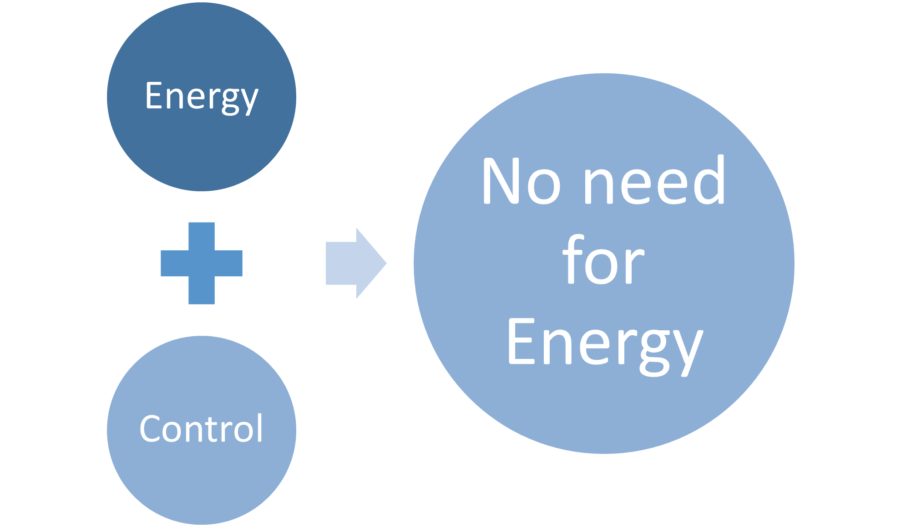

Project overview.
====================

### IEMS Model.

 Talking now about the control, how we could control energy usage if only users are responsible about using the energy offered on their hands. In psychology of human, there is a rule says that, when we have more, we consume more, which is a common human being behavior. Unless we are not conscious, and not well cultured with how big the issue is or even fighting this craving attitude to energy availability, so then we have to let it be done and forcedly by something else, AI!

I gave it the name : SMARTII-ACT, it will manage the energy use of a whole factory X, and only this system will decide how the factory will use their energy taking in consideration some specific criterions: Allocation, criticality and priority.. In this prototype model I have considered only two factors : Energy Allocation and Criticity of the equipment or the process, which I believe they are important policy criterions for an industrial scale. 

### Model synopsys.

- The model developed is using Machine learning techniques that involove many classification algortithms : SVM, Decision Tree..

- The optimal solution is found in regard of the dataset used by the author which based on his own privious experience in the field with many industrial companies.

- Datasets used to train the model can change the model outputs.

### Model classification policy. 

- The classifiaction model is done in discrete time, i.e. the timeline is divided into smaller time steps (for example 1 minute) and in each time step everything is kept constant.

- The confusion matrices are used to measure the accuracy of model results.

- The model is generic and still need more training on reel world datasets to prove its gloabal performance.

### Training complexity. 

We need to know the company size in order to see if the model is computationaly cost effective or not.The model size is mainly dependant on the used dataset, the number of policy criterions aquired and the number of targeted process or equipements that a company has.